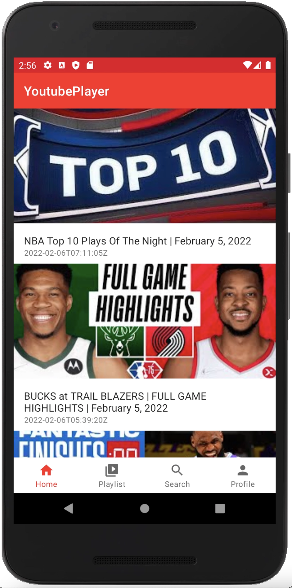
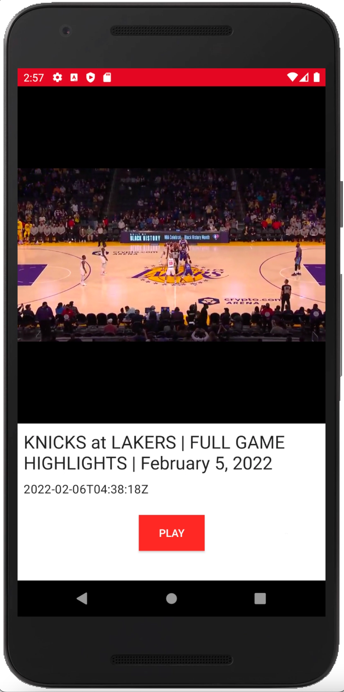
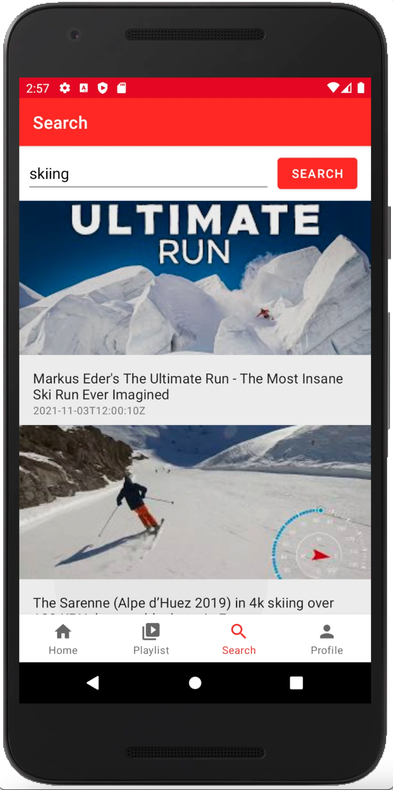
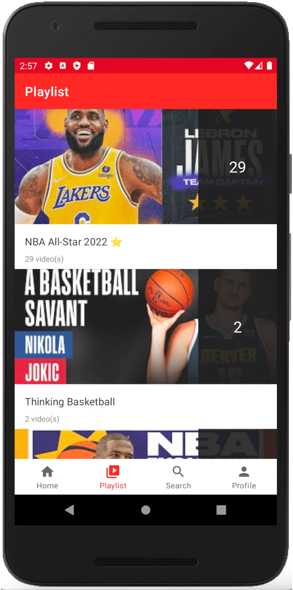
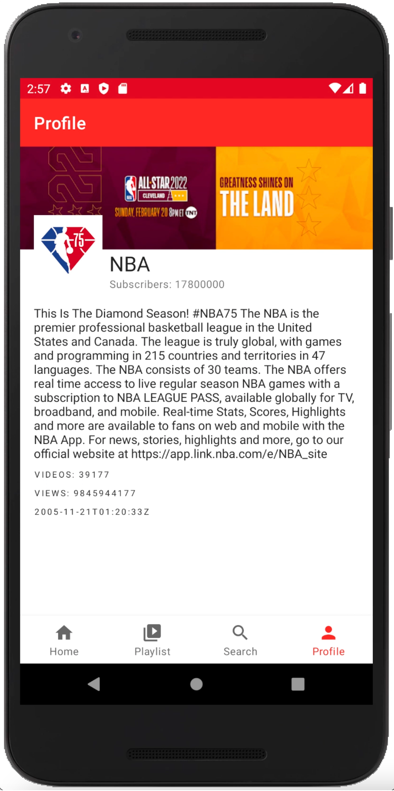

# Android Youtube Player

### COMP 2601 Mobile Applications Term Project

Anant Ojha 
 
anantojha@camil.carleton.ca
 
 

#### Run Instructions:
- Open the app in Visual Studio
- Clean the project (Build -> Clean Project)
- Build the project 
- Run the project 

#### GET API KEY:
- Create a google develops account	(https://console.cloud.google.com)
- Create a new project 
- Create an API key for project
- Enable Youtube Data API v3
- Replace API key in /network/YoutubeAPI.java file 

 

#### VIDEO

#### SEARCH

#### PLAYLIST

#### PROFILE

